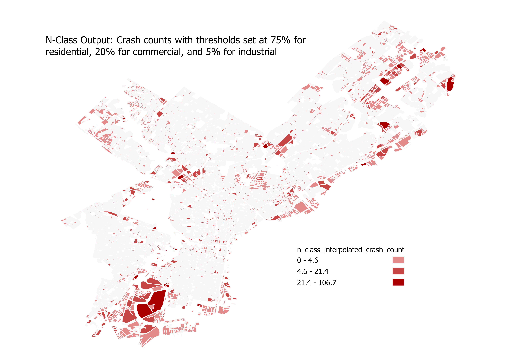

Example Usage
===============

Interpolating car crash data with areal weighting
---------------------------------------------------
For this example, we will be using loading shapefiles from Philadelphia as GeoDataFrames.
The first shapefile is `crash data aggregated by Traffic Analysis zone (TAZ) <https://github.com/CityOfPhiladelphia/crash-data>`_.
The second shapefile is `Census Block Groups <https://www.opendataphilly.org/dataset/census-block-groups>`_.

In this example, we want to interpolate the number of crashes from TAZ in the source layer, to Census Block group in our target layer.
We can see from the crash-data attributes that the field for aggregated crashes is named ``Count_``. Calling the areal weighting method looks like this:

>>> pypolate.arealwt(carcrash.df, census.df, Count_, '_intp')

If you map the output DataFrame and compare it to the input DataFrame, this is what it should look like:

.. image:: assets/aw_output.png
    :width: 100%
    :alt: areal weighting output

Masking land-use categories with the binary method
----------------------------------------------------
In this example, we will use the `Philadelphia crash data <https://github.com/CityOfPhiladelphia/crash-data>`_ again, but
this time we will use `land-use data <https://www.opendataphilly.org/dataset/land-use>`_ as an ancillary data source. Let's take a look at our data:

.. image:: assets/bm_test.png
    :width: 100%
    :alt: binary method data

This method will use the land use shapefile to mask out certain land use types from the crash data shapefile.
Car crashes definitely shouldn't happen on water, and there may be other land use types you'd want to mask out.
For this example, let's assume that we want to interpolate the car crash data to just residential land use.
Here's what our inputs should look like:

>>> pypolate.binary(carcrash.df, landuse.df, 'C_DIG1', [2,3,4,5,6,7,8,9],  '_intp', [Count_])

Lets make the output DataFrame to see what our results look like:

Setting land-use category thresholds with the limiting variable method
------------------------------------------------------------------------
For this example, we can continue to use the `Philadelphia crash data <https://github.com/CityOfPhiladelphia/crash-data>`_ 
and `land-use data <https://www.opendataphilly.org/dataset/land-use>`_. Our starting data will look like this:

.. image:: assets/bm_test.png
    :width: 100%
    :alt: lim_var inputs

Calling the limiting variable method will look like this:

>>> pypolate.lim_var(carcrash.df, landuse.df, 'C_DIG1', {1: 100, 2: 50, 3: 50}, [Count_], 'TAZ', '_intp')

Mapping the output of this should look something like this:

.. image:: assets/lv_output.png
    :width: 100%
    :alt: lim_var outputs

Assigning weights to land-use categories with the n-class method
-------------------------------------------------------------------
For testing the n-class method, we can continue using the `Philadelphia crash data <https://github.com/CityOfPhiladelphia/crash-data>`_ and
`land-use data <https://www.opendataphilly.org/dataset/land-use>`_. Our starting data will look like this again:

.. image:: assets/bm_test.png
    :width: 100%
    :alt: n_class inputs

The inputs for n-class method are very similar to the limiting variable method,
but instead of passing in a dictionary of thresholds based on square units, we pass in percentages as a decimal for our thresholds. 
The percentages should add up to 100%, regardless of how many classes you are splitting between.
For this example, we'll assign 75% to residential, 20% to commercial, and 5% to industrial:

>>> pypolate.n_class(carcrash.df, landuse.df, 'C_DIG1', {1: 0.75, 2: 0.20, 3: 0.05}, [Count_], 'TAZ', '_intp')

The output of the n-class method using this data should look like this when mapped:

Disaggregating population with the parcel method
-------------------------------------------------
For the parcel method, we will use `tax lot data from NYC's MapPLUTO <https://www1.nyc.gov/site/planning/data-maps/open-data/dwn-pluto-mappluto.page>`_, 
and `population at the census block group level from TIGER/Line <https://www.census.gov/cgi-bin/geo/shapefiles>`_. Our data will look like this to begin:

.. image:: assets/pm_input.png
    :width: 100%
    :alt: pm_input

The data that we will be interpolating is population, which is currently aggregated in census block groups.
Using the parcel method, the population can be disaggregated into individual parcels. Our inputs should look like this:

>>> pypolate.parcel(block_group.df, parcels.df, 'UnitsTotal', 'UnitsRes', 'BldgArea', 'ResArea', [population])

The parcel method will interpolate population into two new columns which are calculated from different inputs. 
One of the new columns is named ``ara_derived`` (derived from adjusted residential area), and the other column is named ``ru_derived`` 
(derived from number of residential units). Below are the results of the parcel method, one map for each interpolation type:

.. image:: assets/pm_ara_output.png
    :width: 100%
    :alt: ara_derived ouput

.. image:: assets/pm_ru_output.png
    :width: 100%
    :alt: ru_derived ouput

Refining parcel method with the Cadastral-Based Expert Dasymetric System
-------------------------------------------------------------------------------

Like the parcel method, we'll be using `census block groups <https://www.census.gov/cgi-bin/geo/shapefiles>`_ containing population, and `parcel data <https://www1.nyc.gov/site/planning/data-maps/open-data/dwn-pluto-mappluto.page>`_.
In addition, we are also using a larger census zone DataFrame (which also contains population) that the smaller census zone nests inside, in this case `census tracts <https://www.census.gov/cgi-bin/geo/shapefiles>`_.

*The CEDS method works perfectly with census data, but theoretically will work with any two geographies that nest without intersecting.*

Our input data will look like this if plotted:

.. image:: assets/es_input.png
    :width: 100%
    :alt: es_input

For our inputs, the columns that we are interpolating (population) needs to have the same column name in both source DataFrames (tracts and block groups). 
Other than that condition, the inputs for CEDS are very similar to the parcel method.

>>> pypolate.expert(tracts.df, block_group.df, parcels.df, 'UnitsTotal', 'UnitsRes', 'BldgArea', 'ResArea', [population])

The mapped output of these inputs should look similar to this (the column expert_sys is mapped here):

.. image:: assets/es_output.png
    :width: 100%
    :alt: pm_output

The dataframe that results from the CEDS method contains both the ``ru_derived`` and ``ara_derived`` interpolations for population, 
as well as a new field named expert_sys. As seen in the dataframe below, CEDS determines whether to use ``ru_derived`` or ``ara_derived`` to measure population, 
on a census block group basis. In Block Group 3 of ``GEOID`` 360610271003 CEDS chooses the ``ru_derived`` population,
then chooses the ``ara_derived population`` for block group 1 of ``GEOID`` 360610277001.

